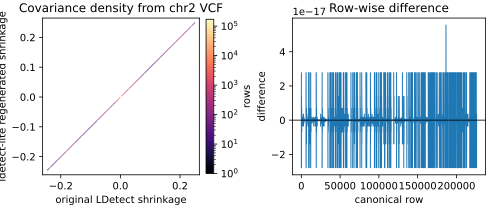
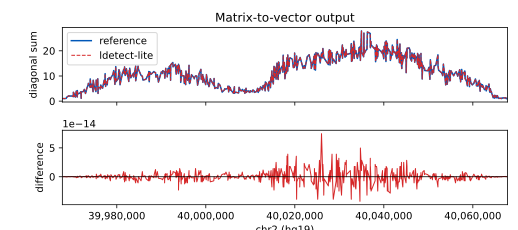
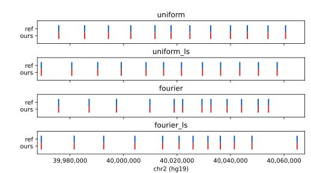
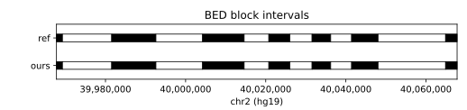
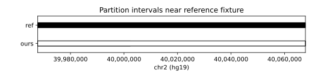

# Exactness Checks

This document summarises the current exactness checks for the toy EUR chr2
example distributed with original LDetect. The example workflow starts from the
matching 1000 Genomes Phase 1 VCF interval, regenerates `ldetect-lite`
artifacts, and compares them to downloaded copies of the original reference
fixtures.

Run from `examples/ldetect_example/`:

```bash
uv run snakemake --cores 1
```

The workflow writes comparison tables under
`examples/ldetect_example/results/` and plots under
`examples/ldetect_example/plots/`.

## Summary

| Artifact | Result |
|---|---|
| Covariance rows and keys | exact, 226,074 rows |
| Covariance values | equivalent to roundoff; max shrinkage difference `5.55e-17` |
| Matrix-to-vector output | all 671 loci equivalent; max absolute difference `7.46e-14` |
| Breakpoint JSON | exact for `fourier`, `fourier_ls`, `uniform`, and `uniform_ls` |
| BED blocks | exact; 13/13 blocks and 14/14 boundaries match |
| Staged toy partition | exact; 1/1 interval matches |
| Independently generated whole-chromosome partitions | diagnostic only; not expected to match the one-window toy fixture |

## Figures











## Notes

The covariance comparison reports `all_exact=no` because the shrinkage values
are not bit-identical after independent floating-point regeneration. The
position keys, naive values, genetic positions, and SNP IDs are exact; the
maximum shrinkage-value difference is `5.551115e-17`, so the comparison is
classified as equivalent.

The generated partition diagnostic compares a whole-chromosome partitioning run
to the original toy example's single-window fixture. The staged partition file
used by the end-to-end toy pipeline is the exactness target for downstream
steps and matches exactly.
