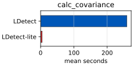
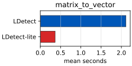
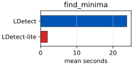
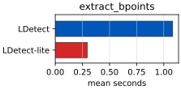
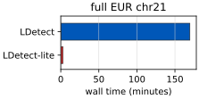

# Performance Optimizations

**Human-oriented reference.** This documents completed, shipped performance work only, for readers who want to understand *why* the pipeline is fast. It is not a task list or a log — in-progress investigation notes and design history live under `notes/logs/`; distilled current-status findings live under `notes/findings/`.

This document summarises the performance improvements applied to `ldetect-lite` since the initial implementation.

---

## Example benchmark figures

The toy chr2 benchmark in `examples/ldetect_example/` compares command-level
original LDetect scripts against command-level `ldetect-lite` invocations on
the same VCF-start example interval. Reproduce the figures with:

```bash
cd examples/ldetect_example
uv run snakemake --cores 1
uv run python scripts/benchmark_legacy_pipeline.py --warmups 1 --repeats 5
uv run python scripts/benchmark_legacy_covariance.py --warmups 0 --repeats 1
```

`uv run snakemake --cores 1` must run first — it prepares `ref/` and `work/vcf/`
(downloaded reference intermediates plus the matching 1000G VCF interval) that
both benchmark scripts require, and it also regenerates the exactness figures
described in [`docs/exactness.md`](exactness.md).

Timing plots are tracked under `examples/ldetect_example/plots/`:









Current measured command-level timings on the example interval:

| Stage              | Original LDetect mean seconds | `ldetect-lite` mean seconds | Speedup |
| ------------------ | ----------------------------: | --------------------------: | ------: |
| `calc-covariance`  |                        259.278 |                       4.651 |  55.75x |
| `matrix-to-vector` |                          2.112 |                       0.365 |   5.79x |
| `find-minima`      |                         23.844 |                       1.892 |  12.60x |
| `extract-bpoints`  |                          1.082 |                       0.296 |   3.66x |

Measured on the same Xeon E5-2620 v4 host as the full EUR chr21 benchmark
below; this supersedes an earlier measurement (96.649s / 3.276s / 29.50x for
`calc-covariance`, etc.) taken on a different, faster host — see the hardware
note under the chr21 table.

The full EUR chr21 timing benchmark is generated from the
`examples/ldetect_original/` reproduction workflow. It compares the vendored
legacy downstream LDetect scripts against `ldetect-lite` on the same staged
chromosome data; see that example's README for the exact commands.



| Stage      | Original LDetect mean seconds | `ldetect-lite` mean seconds |   Speedup |
| ---------- | ----------------------------: | --------------------------: | --------: |
| `pipeline` |                  10177.000000 |                   168.860000 | 60.268862 |

Measured on an Intel Xeon E5-2620 v4 @ 2.1GHz. This supersedes an
earlier measurement (6605.0s / 210.79s / 31.33x) taken on a newer AMD EPYC
9554 host — absolute times are not comparable across hosts, but legacy and
`ldetect-lite` were timed together on the same host in both cases, so each
speedup ratio is a valid same-environment comparison.

The covariance benchmark is intentionally a command boundary comparison:
legacy uses the vendored `P00_01_calc_covariance.py` script with the prepared
VCF streamed through stdin, while `ldetect-lite` uses the default bitpacked
`ldetect calc-covariance` path on the same indexed VCF interval. Downstream
stage timings use the compact bitpacked covariance cache generated by that
command-level covariance benchmark. See
[`docs/exactness.md`](exactness.md) for the matching equivalence checks and
exactness figures.

A third, function-level benchmark calls the same four stages directly (no CLI
launch overhead) and additionally supports comparing the `bitpacked` vs.
`uint8` covariance backends:

```bash
cd examples/ldetect_example
uv run python scripts/benchmark_functions.py --warmups 1 --repeats 5
uv run python scripts/benchmark_functions.py --warmups 1 --repeats 5 --ld-kernel uint8
```

This writes `results/function_benchmark/{timings,exactness}.tsv`,
`summary.md`, and a per-stage `timings.svg`/`.png` bar plot. `results/` is
git-ignored (scratch/local output), so this plot is not tracked or embedded
here — rerun the command to regenerate it.

For the full-chromosome (EUR chr21) runtime, resource-usage (peak RSS,
core utilization vs. dataset size), and profiling-timeline benchmarks, see the
"Full EUR chr21 Runtime Benchmark" and "Resource Profiling" sections of
[`examples/ldetect_original/README.md`](../examples/ldetect_original/README.md)
for the exact commands; those benchmarks need a full staged chromosome
replication and are not reproducible from the toy example alone.

For the VCF/BCF ingestion micro-benchmarks used to validate items #17 and #18
below (per-process genetic-map caching, vectorized genotype decoding, fused
direct-vector Step 2/3), see the "VCF/BCF Ingestion Profiling" section of
[`examples/ldetect_example/README.md`](../examples/ldetect_example/README.md).
Those scripts write TSV timing tables, not plots.

---

## 1. Numba JIT for pairwise LD kernel (`shrinkage.py`)

**Affected code:** `_pairwise_ld_impl` in `src/ldetect_lite/shrinkage.py`

The inner pairwise LD kernel was decorated with `@_jit` (`numba.njit(cache=True)` when Numba is available, no-op otherwise). The vectorised inner loop uses `np.sum(a * b)` instead of an explicit Python loop (Numba does not support `np.dot` on `uint8` arrays via BLAS).

**Measured speedup:** ~50× over pure Python on a 200-SNP × 400-haplotype matrix. Numba compilation (~300 ms first run) is disk-cached via `cache=True`, so subsequent calls pay no compile cost.

---

## 2. Parallel covariance calculation (`_cli/cmd_run.py`)

**Affected code:** `src/ldetect_lite/_cli/cmd_run.py`

Covariance partitions are fully independent (each writes to its own `{name}.{start}.{end}.h5` file). The sequential loop was replaced with `concurrent.futures.ProcessPoolExecutor`. The tabix spawn + `calc_covariance` call was extracted into a module-level `_calc_partition(...)` function so it is picklable.

**CLI:** `ldetect run --workers N`

**Speedup:** Linear with core count up to the number of partitions (~40 per chromosome).

---

## 3. O(log n) locus index lookup (`local_search.py`, `metric.py`, `matrix_analysis.py`)

**Affected code:** all three modules above

`list.index(value)` performs a linear O(n) scan. Every partition boundary triggers one such lookup to relocate `curr_locus` after the list is updated. Replaced with `bisect.bisect_left` (O(log n)):

```python
# before
curr_locus_index = self.locus_list.index(curr_locus)

# after
i = bisect_left(self.locus_list, curr_locus)
if i < len(self.locus_list) and self.locus_list[i] == curr_locus:
    curr_locus_index = i
else:
    ...  # fallback
```

For a chromosome with ~4 000 loci per partition, the worst case drops from ~4 000 comparisons to ~12.

---

## 4. Float arithmetic by default for local search and metric (`local_search.py`, `metric.py`, `pipeline.py`)

**Affected code:** `LocalSearch`, `Metric`, `find_breakpoints`, CLI flags

The original implementation used `decimal.Decimal` at 50-digit precision for all breakpoint metric comparisons and accumulation. This is ~10–30× slower than native `float` arithmetic with no practical difference in results for typical LD data.

`float` is now the default. Decimal precision is opt-in via `--high-precision`:

```
ldetect find-minima --high-precision ...
ldetect run --high-precision ...
```

Internally controlled by `use_decimal: bool = False` on `LocalSearch.__init__`, `Metric.__init__`, and `find_breakpoints`.

---

## 5. Parallel local search (`pipeline.py`)

**Affected code:** `_run_local_search`, `_local_search_worker`, `_local_search_group_worker` in `src/ldetect_lite/pipeline.py`

Each breakpoint's local search is independent. The sequential loop over breakpoints was replaced with `ProcessPoolExecutor`. The inner `_run_single` closure was extracted to a module-level `_local_search_worker(...)` function for picklability.

**CLI:** `ldetect find-minima --workers N` and `ldetect run --local-search-workers N`.

**Speedup:** Linear with core count up to the number of breakpoints (~50–100 per chromosome).

**Memory fix:** the multi-worker path originally submitted one task per breakpoint, each independently loading its own covariance partitions from disk with no sharing. Concurrent breakpoints whose windows fell in the same region redundantly reloaded the same large partition, so peak memory scaled with in-flight *breakpoints*, not workers — this caused an OOM `BrokenProcessPool` crash on a large real-world run. Fixed by reusing the same partition-grouping already used by the single-worker path (`_group_local_search_tasks`): the process pool now submits one task per *group* of breakpoints that share partition bounds (`_local_search_group_worker`), loading each partition once per group and running that group's breakpoints sequentially within the worker, so peak memory scales with concurrent workers, not concurrent breakpoints. Verified to produce identical loci/metrics to the single-worker path (`tests/integration/test_pipeline.py::test_find_breakpoints_multiworker_matches_single_worker`).

---

## 6. Eliminate `math.sqrt` per pair in matrix-to-vector conversion (`matrix_analysis.py`)

**Affected code:** `calc_diag_lean` in `src/ldetect_lite/matrix_analysis.py`

The correlation coefficient was computed as `corr = cov / sqrt(diag_x * diag_y)` and then squared in `_add_corr_coeff`. Since only `r²` is needed, the sqrt is unnecessary:

```python
# before
corr = matrix[x][y] / math.sqrt(diag_x * diag_y)
self._add_corr_coeff(corr, curr_locus)  # squared inside

# after
cov = matrix[x][y]
self._add_r2(cov * cov / (diag_x * diag_y), curr_locus)
```

`_add_corr_coeff` was renamed `_add_r2` to reflect that it receives `r²` directly. The `calc_diag` (heatmap) path still computes `corr` to store `corr_coeff`, so `math.sqrt` is retained there.

For a partition with N loci, this eliminates one `math.sqrt` call per off-diagonal pair processed (~N²/2 calls total per partition).

---

## 7. Indexed HDF5 covariance partition files (`shrinkage.py`, `io/covariance_hdf5.py`, `io/partitions.py`)

**Affected code:** `calc_covariance` in `src/ldetect_lite/shrinkage.py`; HDF5 readers/writers in `src/ldetect_lite/io/covariance_hdf5.py`; `read_partition_into_matrix_lean`, `read_partition_into_matrix` in `src/ldetect_lite/io/covariance.py`; `CovarianceStore.partition_path` in `src/ldetect_lite/io/partitions.py`

Partition files are stored as indexed HDF5 files (`.h5`). HDF5 gives chunked reads, persistent row indexes, and a compact schema that supports restartable production runs without materializing full partitions.

**Write side:** `calc_covariance` previously iterated over all pairs in Python with an f-string per row. Current writers emit typed HDF5 datasets for canonical position pairs and shrinkage LD values, plus diagonal and `lo` row-offset indexes:

```python
write_covariance_partition_hdf5(
    output_path,
    i_pos=pos_arr[ii],
    j_pos=pos_arr[jj],
    shrink_ld=ds2_arr,
    i_gpos=gpos_flat[ii],
    j_gpos=gpos_flat[jj],
    naive_ld=d_naive_arr,
    i_id=rs_arr[ii],
    j_id=rs_arr[jj],
)
```

**Compact write side:** `ldetect run` defaults to `--covariance-cache compact`, which writes only `lo`, `hi`, `shrink_ld`, diagonal entries, and row indexes. The compact writer streams bounded chunks into HDF5 so large partitions do not need full `i_pos`/`j_pos`/metadata arrays in memory.

**Read side:** matrix-to-vector, metric, and local-search paths read typed HDF5 arrays and use the `lo_offsets` index for bounded row scans.

**Estimated impact** (based on representative partition profiling):

| Operation      | Before                               | After                                   | Speedup                                 |
| -------------- | ------------------------------------ | --------------------------------------- | --------------------------------------- |
| Write          | row-oriented Python formatting       | typed HDF5 dataset writes/chunk appends | removes per-row Python formatting       |
| Read           | row-oriented parsing and broad scans | typed HDF5 reads plus indexed scans     | avoids parsing and full scans           |
| Working memory | full pair arrays plus metadata       | compact chunk streaming in `run`        | bounded by chunk size for compact cache |

---

## 8. Local variable caching for hot inner loop (`matrix_analysis.py`)

**Affected code:** `calc_diag_lean` and `calc_diag` in `src/ldetect_lite/matrix_analysis.py`

`self.matrix` and `self.locus_list` are attribute lookups that Python resolves via `__getattribute__` on every access. In the innermost loop, these are accessed dozens of times per locus. Binding them to local variables before the outer `while` loop reduces attribute lookup overhead:

```python
matrix = self.matrix
locus_list = self.locus_list

while curr_locus <= end_locus:
    ...
    x = locus_list[curr_locus_index]
    ...
    if x in matrix and y in matrix[x]:
```

---

## 9. zstd covariance compression (`io/covariance_hdf5.py`)

**Affected code:** `write_covariance_partition_hdf5`, `write_compact_covariance_partition_hdf5_chunks`/`_append` in `src/ldetect_lite/io/covariance_hdf5.py`

`shrink_ld` dominates covariance partition storage (82% of file size in measurement) and barely compresses under `lzf` (compression ratio 0.972). Switched the default HDF5 compression codec to `zstd` (via the new `hdf5plugin` dependency), which strictly dominates both `lzf` and `gzip` at full float64 precision — smaller, faster to write, and faster to read, with no tradeoff.

**CLI:** `--covariance-compression {lzf,zstd}` on `ldetect run` and `ldetect calc-covariance` (default: `zstd`).

**Measured impact:** validated on the full 1000G dataset (22 chromosomes x 3 populations): 66/66 chromosome x population combinations show byte-identical downstream vectors, exact breakpoints, and exact BED boundaries (compression is lossless), a 12.4% covariance-directory size reduction (1000.65 GB -> 876.43 GB), and a 1.2x aggregate wall-clock speedup.

---

## 10. cyvcf2 VCF/BCF I/O (`shrinkage.py`)

**Affected code:** `calc_covariance` in `src/ldetect_lite/shrinkage.py`; call sites in `src/ldetect_lite/_cli/cmd_run.py` and `src/ldetect_lite/_cli/cmd_covariance.py`

`calc_covariance` previously read genotypes via a per-partition `tabix -h <path> <region>` subprocess piped into a naive per-line text parser (`str.split` on each VCF row). Replaced with [cyvcf2](https://github.com/brentp/cyvcf2), a C-extension VCF/BCF reader backed by htslib: `cyvcf2.VCF(path, samples=...)`, region-restricted via `vcf(region)`. This removes the external `tabix` process spawn on every partition and replaces `str.split`-based genotype parsing with htslib's C bindings. `cyvcf2` is a small dependency (~2.2 MB installed; htslib is statically bundled, no system package required).

Because cyvcf2's region-fetch API is format-agnostic given the right index (`.tbi` for `.vcf.gz`, `.csi` for `.bcf`), BCF input support falls out of the rewrite rather than needing separate code — `ldetect calc-covariance --reference-panel panel.bcf` works with no additional implementation.

This also fixed an untested gap: previously, a requested individual missing from the VCF header silently produced empty output (every row dropped, no error). `calc_covariance` now raises `ValueError` naming every missing individual up front.

**Measured impact:** chr21, EUR panel, full `ldetect run` pipeline. VCF.gz and BCF input (identical content) produced byte-identical output (vector sha256, breakpoints, BED boundaries all exact — 23/23 loci match), confirming BCF correctness at real chromosome scale. BCF input was also faster and lower-memory than VCF.gz: 168.9s vs. 189.2s wall-clock (~11% faster) and 4.21 GB vs. 5.99 GB peak RSS (~30% less), consistent with skipping gzip decompression in favor of BCF's binary encoding. For large reference panels, prefer `.bcf`/`.csi` input over `.vcf.gz`/`.tbi` where practical.

**CLI:** `ldetect calc-covariance --reference-panel PATH --region CHROM:START-END` (direct indexed file); `--reference-panel` omitted reads from stdin instead, unchanged from before.

---

## 11. Thread-parallel filter-width search (`find_minima.py`)

**Affected code:** `_find_end`, `_trackback`, `custom_binary_search_with_trackback` in `src/ldetect_lite/find_minima.py`; `find_breakpoints` in `src/ldetect_lite/pipeline.py`

Profiling a real chromosome run (`examples/ldetect_original/plots/EUR-chr21-timeline.pdf`) surfaced a large, previously-uninstrumented single-threaded span between step 3 (matrix-to-vector) and step 4's metric computation: ~34 of ~64 total seconds, flat single-core CPU and RSS. Root cause: `custom_binary_search_with_trackback` (finding the Hanning filter width that yields a target breakpoint count) makes ~40 sequential calls to `apply_filter`, each running `scipy.ndimage.convolve1d` — a direct (non-FFT) convolution costing O(N·width) — at widths in the thousands.

The coarse/fine trackback refinement phase evaluates a boundable, predictable set of candidates per round and is thread-parallelized without changing numerics: `_trackback` batches each round's candidate window in chunks of `search_workers` and applies the same first-match-wins decision rule in the same order. The exponential doubling search (`_find_end`) is intentionally sequential: later doubling candidates can be much more expensive than earlier ones, so batching them can waste minutes evaluating huge filters after an earlier candidate already satisfies the stopping rule. The core binary search is also sequential because each step is adaptive on the previous comparison. We confirmed empirically that the direct convolution/`argrelextrema` calls release the GIL enough for real `ThreadPoolExecutor` speedup during trackback.

Within-convolution parallelism is available via a split policy: adaptive single-candidate phases (exponential search, binary search, and final minima extraction) use `max(--workers, --filter-workers)` threads over output rows, while trackback keeps candidate-width threading and forces each concurrent candidate filter to one thread to avoid nested parallelism. The within-convolution layer was first implemented with a Numba `prange` kernel and later replaced by a row-chunked `ThreadPoolExecutor` after `prange` turned out not to scale in practice — see #15.

The core binary search (`find_le_ind`) is **not** parallelized: each step is adaptive on the previous comparison, so it can't be pre-batched the same way without a different (k-ary search) algorithm, and it's a shared utility used elsewhere — out of scope for this pass.

An FFT-based convolution (`scipy.signal.fftconvolve`, O(N log N) instead of O(N·width)) was tried and reverted: it is numerically unsafe for this pipeline. Direct convolution produces bit-identical output across flat/constant stretches of the input vector, so the downstream minima detector's strict `<` comparison never fires there; FFT convolution's rounding error is not shift-invariant and injects distinct noise at every position, breaking exact ties and manufacturing spurious minima (confirmed: 1 real minimum became 23 detected on a synthetic flat-plateau test). Since the search hunts for a width producing an exact minima count, spurious minima anywhere could converge to a materially different breakpoint set. See `notes/logs/multicore-utilization-filter-width-search.md` for the full investigation.

**CLI:** candidate-width trackback threading reuses `find_breakpoints`'s existing `workers` parameter (`ldetect find-minima --workers N`, `ldetect run --local-search-workers N`) when `--filter-workers 1`. Within-convolution threading is opt-in via `--filter-workers N`.

---

## 12. numba direct convolution for filter-width search (`filters.py`)

**Affected code:** `_reflect_index`, `_pad_reflect`, `_convolve1d_reflect`, `apply_filter` in `src/ldetect_lite/filters.py`

#11's thread-parallelization sped up two of the filter-width search's three phases, but left the core binary search (`find_le_ind`) sequential and paying the full O(N·width) `scipy.ndimage.convolve1d` cost per call (~13s of a ~20s real chr21 run). Replaced `convolve1d` with a hand-written direct convolution compiled via numba (`@njit(nogil=True, fastmath=True, cache=True)`) — same O(N·width) algorithm and same shift-invariant summation structure as scipy's, so it stays flat-region-safe *by construction* (a constant input run still produces bit-identical output at every position, so the downstream minima detector's strict `<` never fires spuriously there), unlike the FFT approach in #11.

The default window mode is `symmetric`/`np.hanning`. This is not merely a legacy-reproduction fallback: Berisa & Pickrell's own supplement specifies the window mathematically as `sin²(πn/(N-1))`, the denominator-`N-1` formula that defines the symmetric (not periodic) Hann window, and `symmetric` is also the conventional windowed-FIR/convolution filter kernel choice. It's also required to reproduce populations whose published reference blocks were generated under scipy <1.1, where `get_window`'s periodic-window construction was a no-op for odd-length windows (the only length `2*width+1` ever produces) and therefore bit-identical to the symmetric window, despite the original code literally requesting periodic. `scipy-periodic`, which uses SciPy's periodic Hann weights and matches modern `scipy.signal.get_window(..., fftbins=True)` behavior, is needed instead to reproduce modern-scipy-era published output (e.g. MacDonald et al. 2022). See `notes/findings/ldetect-original-reproduction.md` for the full writeup.

`numpy.pad` is not numba-jittable, so the `mode='reflect'` boundary (== `numpy.pad(..., mode="symmetric")`, edge value repeated) is replicated via a closed-form reflect-index formula that correctly cycles when `width >= len(array)` (real widths here can exceed vector length).

**`fastmath=True` is required for this to be a net win at all**, not just a nicety: without it, LLVM does not auto-vectorize the reduction loop and the compiled kernel measured ~2x *slower* than `scipy.ndimage.convolve1d`; with it, ~2x *faster*. `fastmath` permits floating-point reassociation, but that reassociation is fixed at compile time and applied identically at every output position — verified empirically that a constant input run still produces bit-identical output with `fastmath=True` (flat-region safety is a property of *shift-invariant application*, not of any particular summation order, so this doesn't reopen the FFT-style risk).

**`nogil=True` is required to not regress #11's threading**: numba does not release the GIL by default, and #11's `ThreadPoolExecutor`-based `search_workers` parallelism only overlaps real work if the GIL is actually released during each call.

A genuinely near-tied edge case was found and fixed during validation, not in production code: a pre-existing test (`test_apply_filter_larger_width_fewer_minima`) used a periodic synthetic signal at a width where scipy's *own* result was already at an exact tie (20 minima at both compared widths, not a real margin). Minima count is not monotonic in width for this signal at intermediate widths — confirmed by sweeping widths 2 through 95 under plain scipy: counts go 20, 18, 15, 21, 25, 24, 20, 18, 9, 3, non-monotonic until asymptotically far apart. Any two numerically-non-identical implementations (not specific to numba — even two scipy versions or BLAS builds) can disagree on exact minima count when the smoothed *output* has near-zero local variation from the signal's own structure, which is a distinct, narrower failure mode than the FFT bug's global-noise-on-constant-*input* problem. Fixed by widening the test's compared widths to a decisive, non-fragile margin (2 vs. 95: 20 vs. 3, agreeing exactly under both implementations). Validated this isn't a realistic production risk: 0 mismatches across 80 randomized trials of noisy random-walk vectors (mimicking real covariance-sum vector structure) at production-representative widths up to 9,000.

**Measured impact:** ~2x per-call speedup over `scipy.ndimage.convolve1d` at realistic widths (8,000-18,000), multiplicative with #11's ~5x threading speedup — combined ~10x over the original sequential-scipy baseline on an 8-candidate batch, measured on real chr21-scale synthetic data. Verified exact minima-index equivalence to scipy (not just numerical closeness) on the flat-plateau fixtures, 80 randomized realistic-noise trials, and the full existing test suite unmodified.

**Fallback if numba is unavailable**: `apply_filter` checks `_HAVE_NUMBA` and calls `scipy.ndimage.convolve1d` directly in that case, rather than an un-jitted `_convolve1d_reflect` (a pure-Python O(N·width) triple-nested loop — ~10^8 iterations at production widths, catastrophically slow rather than just non-optimal). Numba is a hard dependency (`pyproject.toml`), so this path should be unreachable in a correctly-installed environment, but the fallback should degrade to "non-optimal," not "unusable," if it's ever hit. Covered by `test_apply_filter_falls_back_to_scipy_when_numba_unavailable` (monkeypatches `_HAVE_NUMBA`, since actually uninstalling numba isn't practical in CI).

**CLI:** no change; transparent to `apply_filter`'s callers.

---

## 13. BLAS/OMP thread-count guard (`examples/ldetect_original/Snakefile`, `_cli/cmd_run.py`)

**Affected code:** every `ldetect run`/`ldetect matrix-to-vector`/`ldetect find-minima`-invoking rule across `examples/ldetect_original/Snakefile*` (main + all 5 diagnostic/profiling variants except `Snakefile.provenance_diagnostics`, which doesn't run the pipeline), `examples/MacDonald2022/Snakefile`, and `examples/ldetect_example/Snakefile`; `_run` in `src/ldetect_lite/_cli/cmd_run.py`

Found while diagnosing an apparent multi-worker local-search regression during real-cluster validation of #1-#12 (see `notes/findings/multicore-utilization.md`). Numpy/BLAS and numba size their own internal thread pools to the *whole machine's* core count by default, not `--workers` — harmless when a job has a node to itself, but a real oversubscription risk under Slurm-style shared-node scheduling, where several `ldetect run` processes land on the same physical cores simultaneously and each independently assumes it owns every core.

Fixed in the CLI startup path: `src/ldetect_lite/_cli/main.py` now pre-parses the selected command and relevant worker flags before registering subcommands, because subcommand registration imports numpy/scipy/numba-backed modules such as `io.covariance_hdf5`. For process-parallel commands, it sets BLAS/OpenMP/NumExpr caps (`OMP_NUM_THREADS`, `OPENBLAS_NUM_THREADS`, `MKL_NUM_THREADS`, `NUMEXPR_NUM_THREADS`, `VECLIB_MAXIMUM_THREADS`, `BLIS_NUM_THREADS`) to `1` and sets `NUMBA_NUM_THREADS` to the larger of `--workers` and `--filter-workers`. That makes `--workers 4` mean four worker processes total, not four worker processes that can each start four or more native BLAS/OpenMP threads, while preserving a Numba ceiling high enough for phase-specific `prange` sections. The example Snakefiles no longer need to export thread-count environment variables.

**Evidence this matters:** two chromosomes (AFR chr4, chr11) in a 66-row full-replication comparison initially looked like real multi-worker regressions (slower wall-clock, lower core utilization than the general trend). Traced via log timestamps to Slurm scheduling both jobs to start at the identical second — genuine machine contention, confirmed by unrelated/untouched phases (`step3`, `fourier_metric`) also running 7-8x slower under contention, and by a clean 1.7x win when AFR chr4 was re-run in isolation under a 4-CPU cap. That isolated re-run still showed a single ~1-2s sample hitting `cpu_percent_sum=1905%` on a 4-CPU allocation, timed exactly to `_run_local_search`'s `ProcessPoolExecutor` startup — consistent with BLAS/numba worker processes sizing thread pools to the full node rather than the 4-CPU allocation, and a plausible amplifier of the contention above when many such jobs share one Slurm allocation.

**CLI:** no new flags; behavior is driven by `--workers` and `--filter-workers`, not ambient native-thread environment variables.

---

## 14. Bitpacked LD kernel (`shrinkage.py`)

**Affected code:** `_pack_haplotypes_impl`, `_popcount64`, `_compact_pair_chunks_single_pass_bitpacked` in `src/ldetect_lite/shrinkage.py`; `--ld-kernel` on `ldetect run`/`ldetect calc-covariance`

The default pair-count backend for the compact covariance cache: haplotypes are packed into `uint64` words (`_pack_haplotypes_impl`) and pairwise intersection counts are computed via popcount (`_popcount64`) over the packed words, instead of the older `uint8`-array `np.sum(a * b)` kernel. Both backends compute the same popcount-derived pair counts and feed them through the identical Wen-Stephens shrinkage formula, so outputs are expected to be exact matches, not merely close. The `uint8` backend is retained as an optional reference/diagnostic backend.

Landed alongside a shared-arithmetic cleanup in the same hot path: `(1 - theta)^2`, the decay scale, inverse haplotype count, and diagonal adjustment are now computed once per kernel call instead of once per pair; `_genetic_stop_bounds_impl` uses a log-derived genetic-distance threshold equivalent to `exp(-scale * distance) < cutoff`, avoiding an exponential in the bounds pass (preserving the `cutoff <= 0` no-early-stop behavior); VCF/BCF sample-name remapping uses a dictionary rather than repeated `list.index()` calls, with haplotype rows preallocated before filling. These don't change output schema or the shrinkage formula.

**Exactness:** verified bit-exact against the `uint8` kernel in unit tests (`tests/test_shrinkage.py`), at toy-example scale (`examples/ldetect_example/scripts/benchmark_functions.py --ld-kernel bitpacked`), and across all 66 chromosome x population runs for the 1000G EUR, ASN, and AFR diagnostics. Every run produced byte-identical vectors (`vector_sha256_equal=True`, `vector_max_abs_diff=0.0`), exact breakpoint loci, and exact BED boundaries (`bed_jaccard=1.0`).

**Speed and memory:** across EUR, ASN, and AFR, bitpacked reduced aggregate covariance time from 32637.68 s to 30238.12 s (1.079x overall). It was faster on 63/66 chromosome runs; the only slowdowns were AFR chr9 (0.908x), chr12 (0.951x), and chr21 (0.960x). Median chromosome-level speedup was 1.062x. Peak RSS was comparable (`uint8`/bitpacked RSS ratio mean 1.016, median 1.002, range 0.885-1.248). Cache size is unchanged (`covariance_size_ratio=1.0`) because both backends write the same compact HDF5 schema.

**CLI:** `--ld-kernel {bitpacked,uint8}` on `ldetect run`/`ldetect calc-covariance` (default: `bitpacked`). Bitpacked requires compact covariance output. Use `--ld-kernel uint8` for reference-backend comparisons or with `ldetect run --covariance-cache full`.

---

## 15. Row-chunked threaded convolution replaces `prange` for adaptive filter-width search (`filters.py`)

**Affected code:** `_convolve1d_reflect_range`, `_convolve1d_reflect_threaded`, `_chunk_bounds`, `_get_executor` in `src/ldetect_lite/filters.py`; `apply_filter_threaded`/`apply_filter_get_minima_threaded`/`apply_filter_get_minima_ind_threaded` (renamed from the `*_numba_parallel` names); `find_breakpoints` in `pipeline.py`

#11's within-convolution parallelism (adaptive exponential/binary-search/minima-extraction phases, deferred item in `notes/findings/multicore-utilization.md`) originally shipped as a Numba `@njit(parallel=True)` kernel using `prange` over output rows. Real-cluster profiling (`--workers 1 --filter-workers 1` vs. `4`, isolating this from every other pipeline stage) showed it made no measurable difference: the binary-search sub-phase's wall-clock time was identical before and after, despite CPU utilization jumping from ~100% to ~380-400% during that window — i.e. real thread-level parallelism was happening, but not translating into throughput.

**Root cause, isolated with a standalone kernel microbenchmark** (`examples/ldetect_original/scripts/benchmark_filter_threading.py`, no reference panel/VCF needed): ruled out per-call `set_num_threads` reset overhead and threading-layer choice (`workqueue` vs. `tbb` — both showed the same ceiling) before finding the actual mechanism. A thread-count sweep showed the `prange` kernel's per-thread compute throughput was ~3.4x *worse* than the plain serial kernel doing identical work, which fully explained the observed plateau (`4 threads / 3.37x-worse-per-thread ≈ 1.19x`, matching the measured speedup exactly). Narrowing further: Numba's LLVM auto-vectorization of this reduction loop only fires for a literal `range(n)` loop starting at a compile-time-known zero. `prange`'s internally generated per-thread chunk loop has a runtime lower bound (functionally like `range(lo, hi)`), which loses vectorization the same way an explicit `range(lo, hi)` rewrite of the loop measured ~3.4x slower even single-threaded, with no threading involved at all. Confirmed the fix in isolation: slicing the padded input and output arrays to zero-based views per chunk *before* the call (repositioning the pointer instead of the loop bound) fully restored vectorized single-thread throughput and real multi-thread scaling.

**Fix:** removed the `prange`/`parallel=True` kernel and `_numba_thread_limit`/`set_num_threads` machinery entirely. `_convolve1d_reflect_threaded` now splits the output row range into `workers` contiguous chunks (`_chunk_bounds`), slices the padded input and output arrays to zero-based views per chunk, and dispatches each chunk to a plain `nogil`+`fastmath` kernel (`_convolve1d_reflect_range`, no `parallel=True`) via a cached, grow-only `ThreadPoolExecutor` (`_get_executor`) rather than creating/tearing down a pool per call. Reduction order within each row is unchanged from `_convolve1d_reflect` (each row is still computed independently, just possibly on a different thread), so this preserves the same flat-region bit-exactness guarantee as #11/#12 — verified by the existing exactness test suite plus new parametrized tests (`test_threaded_convolve1d_reflect_matches_serial_for_asymmetric_kernel` across 1/2/3/4/8 workers, `test_chunk_bounds_partitions_range_exactly`).

**Measured impact:** synthetic kernel benchmark, N=230,000 (real chr21 vector scale), width=9,000 (real production width), on the actual profiling cluster: `prange` topped out at ~1.19x at 4 threads regardless of thread count (1/2/4/8) or threading layer; the row-chunked replacement measured 1.00x/1.98x/3.92x/7.64x at 1/2/4/8 threads on the same host — real, close-to-linear scaling instead of a hard ceiling. On the real chr21 pipeline (`--workers 4`), the exponential+binary-search portion of `filter_width_search` (the phases this targets) dropped from 5s to 1s (~5x), and the whole `filter_width_search` phase (including still-serial-by-design trackback) from 7s to 4s (~43%), for a 61s -> 58s end-to-end wall-clock improvement (chr21 is a small chromosome; `filter_width_search` is a proportionally larger share of wall-clock on bigger ones). Reproduced identically across four independent measurements: the standalone kernel benchmark, an isolated `--workers 1` phase-only A/B, and two full standard `ldetect run --workers 4` profiling runs on separate occasions (step2/step3/local-search timings matched to the second or better across all of them, confirming the change is cleanly isolated to the targeted phase). See `notes/logs/multicore-utilization-filter-width-search.md` for the full investigation, including the dead ends (per-call reset overhead, threading layer) ruled out along the way and a stale-plot false alarm (a leftover `EUR-chr21-timeline.png`/`.pdf` render showed an unrelated ~3700% one-sample CPU spike; regenerating from the current run's own CSV/log showed no such spike in the actual data — not a real regression, just a stale plot).

**CLI:** no change; `--filter-workers`/`--workers` semantics are unchanged, only the underlying implementation.

---

## 16. Array-backed matrix-to-vector conversion (`matrix_analysis.py`, `_util/vector_array.py`)

**Affected code:** `MatrixAnalysis.calc_diag_lean`/`calc_diag_array` in `src/ldetect_lite/matrix_analysis.py`; `write_diag_vector_array` and its partition helpers in `src/ldetect_lite/_util/vector_array.py`

The original `calc_diag_lean` read each covariance partition into nested Python dictionaries (`{locus: {locus: {"corr_coeff": ...}}}`) and, for every locus, scanned outward through neighboring loci in pure Python to accumulate the `r²` sum for that locus. This is object- and dict-lookup-heavy per pair, on top of the per-partition Python loop itself.

`calc_diag_lean` now defaults to `calc_diag_array`, which reads each partition's `(lo, hi, shrink_ld)` arrays directly, derives the sorted unique locus set with `np.unique`, maps row endpoints to locus indices with `np.searchsorted`, and accumulates each locus's `r²` sum with `np.bincount` instead of a Python-level dict scan. `matrix_workers > 1` additionally parallelizes across partitions via a `ProcessPoolExecutor` (`_write_diag_vector_array_hdf5_parallel`). The old dictionary implementation (`_calc_diag_lean_legacy`) is retained only as a correctness fallback, reachable via `calc_diag_lean(..., backend="legacy")`; it is not used by any CLI path.

**Exactness:** covered by the existing array-vector equivalence regression tests and the toy/full-chromosome reproduction fixtures — array and legacy vector output match exactly, not just within tolerance.

**CLI:** `ldetect matrix-to-vector`/`ldetect run` use the array backend by default. `--matrix-backend {array,legacy}` selects the backend explicitly; `--matrix-workers N` (default: inherit `--workers`) parallelizes Step 3 across partitions.

---

## 17. Fused direct-vector Step 2/3 (`_util/covariance_sidecars.py`, `shrinkage.py`, `_cli/cmd_run.py`)

**Affected code:** `CovarianceSidecarAccumulator` in `src/ldetect_lite/_util/covariance_sidecars.py`; `_diag_values_impl` and the `sidecar` parameter on `calc_covariance` in `src/ldetect_lite/shrinkage.py`; `_calc_partition`, `_fused_vector_ready`, and `_run`'s Step 2/3 wiring in `src/ldetect_lite/_cli/cmd_run.py`

Step 3 (`MatrixAnalysis.calc_diag_lean`) rereads every persisted covariance partition from HDF5 to build the correlation-sum vector, even though that same row data was already fully in memory moments earlier while Step 2 generated it. `calc_covariance` now accepts an optional `sidecar` that tees the exact `CovarianceRowChunk` stream already being written to the HDF5 partition — the persisted output is byte-for-byte unchanged — and accumulates the partition's vector-sum fragment in memory via the existing `_accumulate_vector_chunk`/`_DiagVectorPartitionResult` machinery. The only independently-derived quantity is the per-locus diagonal, computed by the closed-form `_diag_values_impl` (the `i == j` branch of the pairwise kernel collapses to a pure function of `hap_sums`, verified bit-exact against the persisted diagonal) rather than a second kernel pass — avoiding the class of bug that left an unresolved vector residual in an earlier two-kernel-invocation prototype.

Each Step 2 worker returns its fragment directly as its process-pool result — no sidecar file is ever written to disk; the fragment is small (per-locus sums, not per-pair covariance) so returning it through the pool is cheap relative to the Step 3 re-read it replaces. `_fused_vector_ready` gates the fast path: it's only used when every partition was freshly computed this run (no skipped/cached partitions) and none of their sidecars were marked invalid. A sidecar is marked invalid if `calc_covariance` falls off the single-pass write path partway through (a rare defensive fallback, not expected on well-formed data) — its buffered rows would otherwise be an incomplete, silently-wrong view of the partition. Any of these cases fall back to today's post-hoc Step 3 read unchanged, rather than half-solving "some partitions have fragments, some don't."

**Exactness:** `tests/test_cmd_run_fused_vector.py` verifies the fused fragment path produces byte-identical vector output to the post-hoc `MatrixAnalysis.calc_diag_lean` read on real bgzip/tabix-indexed data, and that tee-ing through the sidecar does not change the persisted HDF5 partition at all. `tests/test_covariance_sidecars.py` covers the accumulator's own lifecycle, including the invalid-marking safety net.

**CLI:** `--fused-vector`/`--no-fused-vector` on `ldetect run` (default: enabled). Requires the compact covariance cache (the sidecar only tees the compact single-pass write path); silently unavailable with `--covariance-cache full` rather than erroring. `--matrix-workers` has no effect on the fused path, since it replaces Step 3's worker pool entirely.

---

## 18. Genetic-map caching and vectorized genotype decoding (`_util/reference_panel.py`)

**Affected code:** `read_genetic_map`, `read_reference_panel` in `src/ldetect_lite/_util/reference_panel.py`

Followed up on an external I/O review (`notes/logs/covariance-io-optimization-review.md`, distilled in `notes/findings/covariance-io-optimization.md`) that flagged two concrete, verifiable inefficiencies in the per-partition covariance ingestion path:

1. `read_genetic_map` fully re-parsed the entire gzipped genetic map on every call, even though one `ldetect run` invocation passes the same chromosome-wide map to every partition's `calc_covariance` call. Now `@functools.cache`d per process — a `ProcessPoolExecutor` worker that handles multiple partitions parses the map once, not once per partition — and the parse itself switched from a per-line Python loop to `np.loadtxt`. Measured on a synthetic 1M-row map (realistic per-chromosome scale): ~0.29s per call, ~8.8s of aggregate waste per chromosome run at ~30 partitions before caching. Safe because the returned dict is read-only downstream (no caller mutates it) and every caller passes a stable path per run.
2. `read_reference_panel` decoded genotypes via `variant.genotypes` (builds a Python list of tuples) followed by a per-individual Python loop to unpack and validate them. Switched to `variant.genotype.array()`, `cyvcf2`'s vectorized `(n_samples, 3)` `int16` array form of the same data, letting the phased/missing check and haplotype-row build run as NumPy ops. Measured 1.71x faster on a synthetic 500-sample/5000-variant panel, byte-identical output. The now-unused `n_haps` parameter was removed from `read_reference_panel`'s signature.

**Exactness:** `tests/test_reference_panel.py` (new) covers the caching behavior directly; the existing `tests/test_shrinkage.py` `calc_covariance` suite (missing-individual, unphased/missing-genotype, duplicate-position edge cases) passed unchanged against the new code path.

**Not done:** the review's higher-effort proposals (a whole-chromosome packed haplotype cache; a CSR/banded covariance storage schema) were evaluated and not implemented — see `notes/findings/covariance-io-optimization.md` for why.

**CLI:** no change; transparent to `calc_covariance`'s callers.
